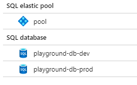
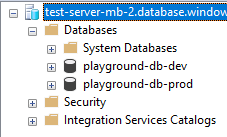

# Walk Through

This is to help create an understanding of how to use DACPACs for deployment of your sql database in an automated fashion using Azure Release pipelines.

Create two database, one for prod and one for dev. I put both databases on a single server.

Create a SQL database in Azure, this will be your dev database.

Run the scripts/sample-model.sql against this database. It will create a few tables. 
(ERD Diagram can be found in scripts folder)
Credit: Script came from: https://www.dofactory.com/sql/sample-database

Create an empty database project in Visual Studio

Goto project->schema compare

Connect to your dev database and run the schema compare process
Your dev database should be on the left, the project on the right
Your pulling changes from your dev and putting it into your project.

# Sync via DacPac manually
View->SQL Server Objects Explorer
Right Click Database->Extract Dac
Choose file location
Uncheck "Include user login mappings"

Goto dest database
Right Click->Upgrade DacPac
Follow prompts
Select DACPAC to restore from
Let it run
